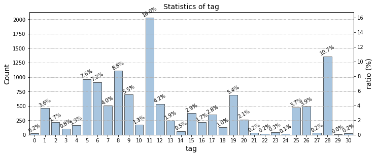
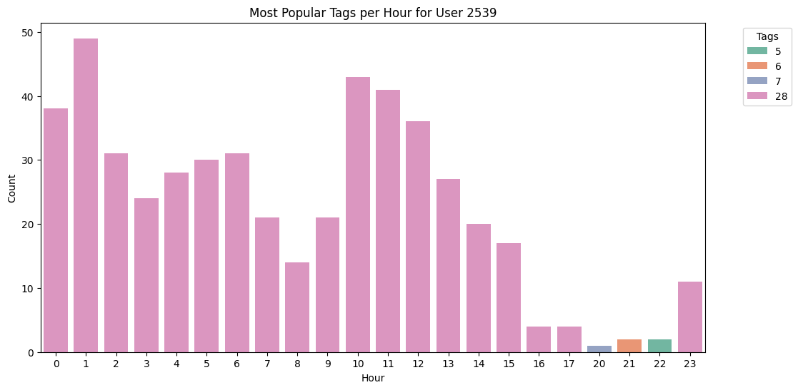
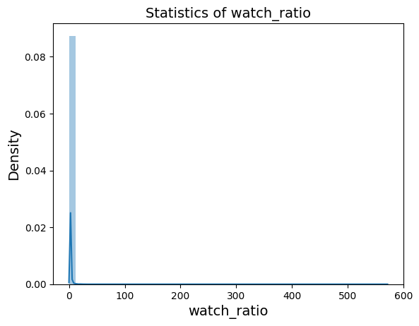

As part of this project, the objective was to design an efficient recommendation system based on the [KuaiRec](https://kuairec.com/) dataset. The challenge was to propose personalized videos to users, leveraging their past interactions, video metadata, user profiles, and a social graph.

# Project Architecture
- als.ipynb: This script implements the Alternating Least Squares (ALS) model, including data preparation, model training, and evaluation.
- analysis.ipynb: This script performs data exploration and analysis, generating visualizations to understand the dataset better.
- baseline.ipynb: This script implements the baseline models based on video popularity and average watch_ratio.
- models/ : This directory contains NCF models .h5 files.
- ncf.ipynb: This script implements the Neural Collaborative Filtering (NCF) model, including data preparation, model training, and evaluation.
- requirements.txt: This file lists the required Python packages for the project.

# Dataset Exploration
The KuaiRec dataset consists of two main matrices: big_matrix.csv, used for training, and small_matrix.csv, used for evaluation. Additional files include item_categories.csv, user_features.csv, social_network.csv, and item_daily_features.csv.
Full exploration of the dataset is available in the analysis.ipy notebook.

## Video Characteristics
- Videos are associated with tags encoded from 0 to 30.
- The tag distribution shows low diversity: tag 11 represents 16% of all tags.

## User Characteristics
There are 1411 users in the small_matrix table and 1176 in the big_matrix table.  
In the user_features table, user attributes are represented using one-hot encoding, indicating the corresponding position for each attribute.

## Social Network Analysis
In this context, a "friend" refers to users who mutually follow each other. The analysis reveals that only a small fraction of users (472) have friends. Among these users, the majority have just one friend. The maximum number of friends observed is 5, with an average of 1.5 friends per user (calculated only for users who have at least one friend).

## Interaction Analysis
Videos contain multiple interaction tags found in the item_item_categories and kuairec_caption_category tables.  
There is low tag variety in interactions. All users share the same tags with the highest interaction levels.  
  
This trend remains consistent throughout the day, with users' most interacted tags changing very little over time.  
  
This is an example for a given user, but the trend is the same for all users.  
  
The watch_ratio represents the proportion of the video watched by the user. Its distribution is remarkably uniform, with an average value close to 0.9.  
  
When analyzing tag distribution based on watch_ratio, greater diversity is observed.  
  
Similar observations can be made regarding the distribution of creators watched, with low diversity in interactions (two favorite creators for all users) and greater diversity based on watch_ratio.  
  

# Baseline Models
To establish a benchmark, I started with two simple models based on video popularity and the average watch_ratio of each video. The first model recommends the most popular videos to all users.  
Popularity is calculated by considering the number of interactions, likes, shares, and comments. A linear regression model was used to predict the weight of these features on the video's watch_ratio.  
Although simple, this model provides a baseline to measure the impact of popularity-based recommendations compared to more complex models.

# Advanced Model Choices
Given the richness and variety of user data, but also the low diversity of tags, I opted for a "Collaborative Filtering" model based on embeddings. This choice captures complex relationships between users and videos, integrating both past interactions and user characteristics. Two models were explored: Alternating Least Squares (ALS) and Neural Collaborative Filtering (NCF).

# Data Cleaning and Preparation
To ensure consistent data for training, several filters were applied:
- Removal of interactions with a watch_ratio of zero or very high (kept up to the 75th percentile to avoid outliers).
- Filtering users with fewer than 248 interactions (to ensure sufficient history).
- Encoding tags as multi-hot vectors (dimension 31).
- Factorizing user categorical variables for embedding use.

These steps aim to eliminate noise and stabilize model training. This process improved results in terms of MAE and RMSE.

# ALS
I first implemented ALS, a matrix factorization method optimized for implicit feedback, as introduced in class. To adapt it to our scenario, I followed the methodology taught, using watch_ratio as the confidence score. The ALS model was trained on the filtered dataset with the following parameters:
- Number of latent factors: 64
- Regularization parameter: 0.1
- Number of iterations: 10
- Implicit feedback: Yes
- Confidence score: watch_ratio

# Neural Collaborative Filtering (NCF)
Based on the analysis, I chose a Neural Collaborative Filtering (NCF) model capable of capturing non-linear relationships between users and videos by combining:
- User and video embeddings (latent factors, dimension K=64).
- User feature embeddings (reduced dimension = 8).
- Dense branch for multi-hot tags (reduced dimension = 16).
- Signal fusion via a two-layer MLP (128 and 64 neurons, ReLU, Dropout 0.2).
- GMF branch for element-wise product of user-video embeddings.

The initial model used a cross-entropy loss function to directly predict the raw watch_ratio. However, it was modified to predict the log-transformed watch_ratio (log1p) using a Huber loss function. This approach better handles extreme values. Several delta values, including the log1p expectation of watch_ratio, were tested for the Huber loss function. The optimal delta identified was 1 for the log-transformed watch_ratio.

Based on the data analysis above, I chose not to use user activity periods and friends as features. Most users have no friends, and tags lack diversity. Similarly, I excluded video captions, which would add little information given the low video variety, to avoid overloading the already complex model running on limited resources.

## NCF Model Exploration
To account for tag diversity in the NCF model, I explored two approaches:
- Adding author_id to the NCF model, treating them as embeddings:  
This increased model complexity and could not be tested due to resource limitations.
- Tag weights in the NCF model:  
Weighting tags based on their popularity, using the average watch_ratio for each tag. This approach aims to diversify recommended videos by considering watch_ratio rather than interaction count.

# Performance Evaluation
The model is evaluated using several metrics:
- MAE (Mean Absolute Error): measures the average prediction error of watch_ratio on the top-K recommended videos.
- RMSE: penalizes larger errors more heavily.
- NDCG@10: evaluates ranking quality, considering the position of relevant videos in recommendations.
- Novelty@10: measures the novelty of recommendations, favoring videos with fewer interactions.
- Average Popularity@10: evaluates the average popularity of recommended videos.

Tag diversity was not considered in this model due to the low diversity of tags in the video and interaction dataset, as mentioned earlier.

# Results
| Model                   | MAE\@10    | RMSE\@10   | NDCG\@10 | Novelty\@10 | Avg. Popularity |
| ----------------------- | ---------- | ---------- | -------- | ----------- | --------------- |
| Popularity              | 1.7405     | 1.8928     | 0.7711   | 2.5669      | 1.2692          |
| Avg. watch\_ratio       | 0.5239     | 0.7640     | 0.8014   | 1.9128      | 1.2185          |
| ALS                     | 0.8481     | 0.9492     | 0.8603   | 1.9056      | 1.0628          |
| NCF                     | 0.8108     | 1.1460     | **0.8656**   | **3.3277**  | 1.0001          |
| NCF with tag weights    | **0.6181** | **0.9222** | 0.8570   | 3.2129      | **0.9941**      |

# Results Analysis
The performance analysis shows significant differences between models in terms of accuracy (MAE, RMSE), ranking quality (NDCG), and recommendation diversity and novelty.

The raw popularity model performs poorly across all criteria, with an MAE of 1.74 and an RMSE of 1.89, indicating poor accuracy in predicting watch_ratio. This result aligns with the fact that this model simply recommends the most popular videos without any personalization. However, its NDCG remains relatively high (0.77), likely because these popular videos are generally well-received by most users. In contrast, its high average popularity (1.2692) and low novelty (2.5669) reveal that it never ventures beyond well-known content.

The model based on the average watch_ratio per video significantly improves accuracy (MAE of 0.52) due to the dataset's homogeneous watch_ratio. However, this model does not account for individual preferences, and its NDCG performance remains moderate. It maintains a high average popularity (1.2185) and low novelty (1.91), suggesting low diversity in recommendations.

The ALS model strikes a better balance. It achieves an NDCG of 0.8603, meaning it can recommend relevant videos at the top of the list, even though it remains less precise in absolute values (MAE of 0.84). Its novelty score (1.9056) and average popularity (1.0628) indicate that it suggests slightly less popular videos than previous models but without significant breakthroughs.

The NCF model brings notable improvements in NDCG (0.8656) while significantly increasing recommendation diversity. Its novelty score reaches 3.3277, the highest among all tested models. This means NCF can recommend videos the user likely has never seen before, increasing discovery potential. Simultaneously, the average popularity of recommended videos (1.0001) decreases, confirming its ability to move beyond dominant content. However, there is a slight degradation in RMSE (1.146), suggesting that the gap between predicted and observed values remains significant in absolute terms.

Finally, the improved NCF with tag weights based on watch_ratio offers an excellent compromise: it achieves an MAE of 0.6181 and an RMSE of 0.9222 while maintaining strong NDCG performance (0.8570). Although slightly behind the standard NCF in novelty (3.2129 vs. 3.3277), this model manages to maintain high diversity while significantly improving accuracy. The average popularity of 0.9941 confirms its tendency to recommend less visible but potentially more engaging videos.

# Future Directions
- Explore hybrid models like Two-Tower Hybrid, combining collaborative filtering and content-based approaches.
- Explore captions: Initially excluded due to low tag diversity and token count but could add an additional dimension to the model.
- Use author_id as embeddings.

# Author
- **Name**: Aniss Outaleb
- **username**: aniss1.outaleb
